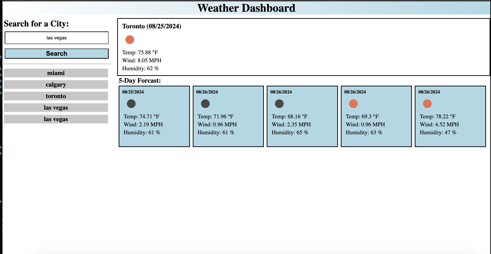

# Weather-Dashboard

## Description

The Weather Dashboard is a web application designed for travelers who want to plan their trips by checking the weather outlook for multiple cities. This application allows users to search for a city and view both current and future weather conditions, which helps in planning trips accordingly.

## Demo

[This website can be found here](https://anamarisortiz.github.io/Weather-Dashboard/)

## User Story

**As a traveler**  
I want to see the weather outlook for multiple cities  
So that I can plan a trip accordingly  

## Features

- Search for a city to view its current and future weather conditions.
- View current weather conditions including city name, date, weather icon, temperature, humidity, and wind speed.
- View a 5-day weather forecast with date, weather icon, temperature, humidity, and wind speed.
- Search history feature to quickly revisit weather data for previously searched cities.

## Technologies Used

- HTML
- CSS
- JavaScript
- OpenWeather API

## How to Use

1. Enter the name of a city in the search bar.
2. Click on the search button to view current and future weather conditions for the city.
3. Check the search history to revisit the weather data of previously searched cities.

## License

This project is licensed under the MIT License. See the [LICENSE](LICENSE) file for details.

## Author

Developed by [Anamaris Ortiz ](https://github.com/AnamarisOrtiz)
